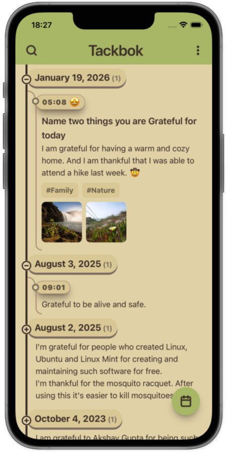
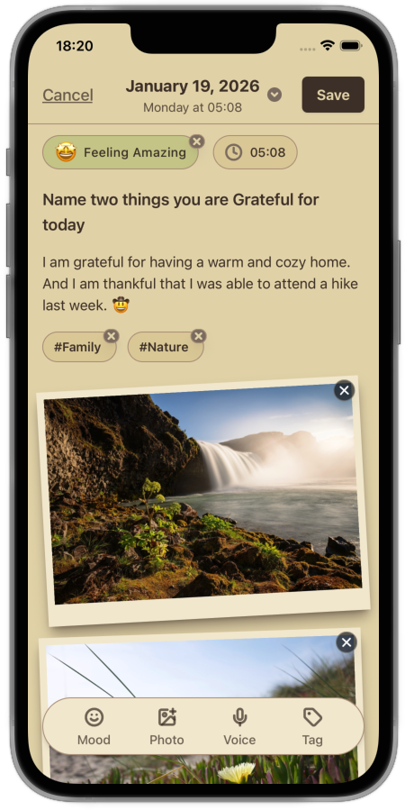

<div align="center">

  <a href="https://tackbok.org" target="_blank">
    
  </a>

# Tackbok

**A quieter place for gratitude.**

<a href="https://tackbok.org" target="_blank">tackbok.org</a>

A free, open-source, local-first gratitude journal for words, photos, and voice memories.<br />
No accounts. No ads. Your journal stays on your device.

  <p align="center">
    <a href="https://github.com/mehradotdev/tackbok/blob/main/LICENSE" target="_blank">
      
    </a>
    <a href="#">
      
    </a>
    <a href="https://expo.dev" target="_blank">
      
    </a>
  </p>

  <p align="center">
    <a href="https://play.google.com/store/apps/details?id=dev.mehra.tackbok" target="_blank">
      
    </a>
    &nbsp;
    <a href="https://apps.apple.com/us/app/tackbok-gratitude-journal/id6757330507" target="_blank">
      
    </a>
    &nbsp;
    <a href="https://apps.samsung.com/appquery/appDetail.as?appId=dev.mehra.tackbok&source=GBadge_01_9271461_tag&directOpen=true&ads=ddb0e6f9&nonOrgType=fce692ba" target="_blank">
      
    </a>
    &nbsp;
  </p>

</div>

---

## 📱 Screenshots

<div align="center">
  <table>
    <tr>
      <td align="center" width="50%">
        <strong>Daily Timeline &amp; Streaks</strong><br /><br />
        
      </td>
      <td align="center" width="50%">
        <strong>Rich Entry Editor</strong><br /><br />
        
      </td>
    </tr>
  </table>
</div>

---

## 🌿 Heritage & Inspiration

> **Presently** proved how powerful a simple, private, distraction-free daily practice can be.
>
> Tackbok carries that torch forward as a spiritual successor, retaining the same zero-ad, offline-first, no-account philosophy, while thoughtfully expanding the canvas to let you capture memories through photos, voice notes, moods, and tags when words alone aren't enough (plus seamless import support for your existing [Presently](https://github.com/alisonthemonster/Presently) backups).

---

## ✨ Features

- **🔒 Local-First & Private**: Entries are stored locally on your device in SQLite, with optional Google Drive backup. Anonymous usage analytics are optional and disabled by default; journal content is never collected for analytics. Optional biometric lock (Face ID / Fingerprint) keeps reflections private.
- **📸 Words, Photos & Voice**: Write freely, then enrich your entries with pictures, clear voice memos, moods, and tags.
- **🧭 Thoughtful Prompts**: Choose focus areas and gentle prompts whenever the blank page feels intimidating.
- **🎨 10+ Curated Themes**: Thoughtfully tailored light and dark palettes (Lavender, Bubblegum, Weckner, Clemens, Dark, Warm, etc.) with customizable typography.
- **⏰ Gentle Reminders**: Build a consistent daily rhythm with customizable notifications.
- **📦 Bring Your History**: Full export/backup and restore, plus one-click import from **Presently**, **Gratitude App**, and Tackbok backups.
- **🌍 Multilingual & RTL**: Built-in support for English, Swedish, Hindi, and right-to-left (RTL) scripts, with more languages continuously added.

---

## 📁 Repository Structure

This repository is a [Bun](https://bun.com) monorepo containing two main apps:

```text
tackbok/
├── apps/
│   ├── mobile/       # React Native Expo mobile app (iOS & Android)
│   └── website/      # Astro marketing website & documentation (tackbok.org)
├── assets/           # Repository preview screenshots and branding assets
├── LICENSE           # Apache License 2.0
└── package.json      # Monorepo root configuration & Bun workspace scripts
```

- **`apps/mobile`**: Built with React Native, Expo SDK 57, Expo Router, Uniwind (Tailwind CSS v4), Drizzle ORM with SQLite, and Zustand.
- **`apps/website`**: Built with Astro 7, Tailwind CSS v4, and daisyUI.

---

## 🚀 Getting Started

### Prerequisites

- Node.js 24 (see `.node-version`)
- [Bun](https://bun.sh) (use the version in the root `packageManager` field)
- For Mobile:
  - **Android**: [Android Studio](https://developer.android.com/studio) — follow the [Expo Android Environment Setup Guide](https://docs.expo.dev/get-started/set-up-your-environment/?mode=development-build&platform=android&device=simulated)
  - **iOS**: [Xcode](https://developer.apple.com/xcode/) (macOS only) — follow the [Expo iOS Environment Setup Guide](https://docs.expo.dev/get-started/set-up-your-environment/?mode=development-build&platform=ios&device=simulated)

### Installation

Clone the repository and install dependencies using Bun:

```bash
git clone https://github.com/mehradotdev/tackbok.git
cd tackbok
bun install
```

### Running the Mobile App

Navigate to `apps/mobile`:

```bash
cd apps/mobile
```

Run on **Android**:

```bash
bun run android
```

Run on **iOS**:

```bash
bun run ios
```

Start the Expo Metro bundler:

```bash
bun run start
```

### Running the Website

Navigate to `apps/website`:

```bash
cd apps/website
bun run dev
```

The website will be available locally at `http://localhost:4321`.

---

## 🛠️ Monorepo Commands

You can run quality checks across all workspaces directly from the repository root:

| Command             | Action                                                     |
| :------------------ | :--------------------------------------------------------- |
| `bun run lint`      | Runs linter across all workspaces (`mobile` and `website`) |
| `bun run typecheck` | Runs TypeScript typechecks across all workspaces           |
| `bun run test`      | Runs the mobile test suites (Jest + Bun test)              |
| `bun run build`     | Builds the website production bundle                       |

---

## Contributing

Small fixes, documentation, translations, and bug reports are welcome. Start with
[CONTRIBUTING.md](CONTRIBUTING.md) for minimal setup, focused PRs, and checks. You
can contribute without configuring native mobile builds or service credentials.

- [Report a bug or request a feature](https://github.com/mehradotdev/tackbok/issues/new/choose)
- [Ask a question or explore an idea](https://github.com/mehradotdev/tackbok/discussions)
- [Development checks and commit conventions](docs/development-checks.md)
- [Mobile localization policy](docs/localization.md)

---

> [!IMPORTANT]
>
> ### 📢 Forking & Distribution Policy
>
> Tackbok is 100% free and open-source software under the [Apache License 2.0](LICENSE). You are welcome to view, fork, modify, add paywalls, or redistribute the source code.
>
> However, we kindly ask that you **do not use the Tackbok name, official logos, or brand identity** when distributing your own modified or cloned versions of the app, especially on official app stores (such as the Apple App Store or Google Play Store), unless you have explicit permission from the creator of Tackbok.
>
> Using your own branding for forks prevents user confusion and respects the work of the independent developer. Aside from branding, you are free to do anything with the code!

---

## 📄 License & Acknowledgments

- **License**: Distributed under the [Apache License 2.0](LICENSE). See `LICENSE` for more information.
- **Special Thanks**: Heartfelt appreciation to Alison and the contributors of [Presently](https://github.com/alisonthemonster/Presently) for creating the wonderful gratitude app that inspired Tackbok.
